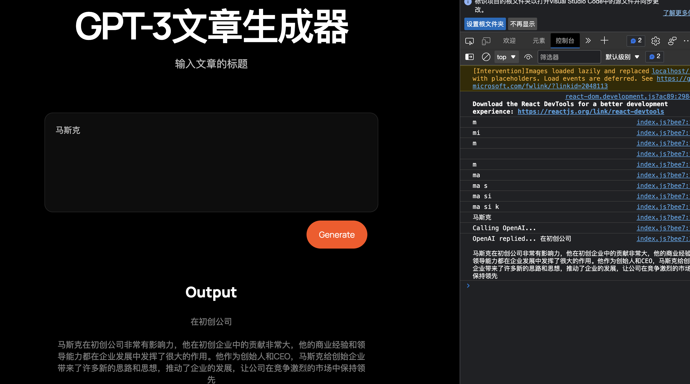

# 依照buildspace制作的基于OPENAI的文章生成器

********************************
# 运行步骤

> cd gpt3-writer-starter
> 
> yarn add next react react-dom
> 
> yarn dev

在浏览器打开http://localhost:3000/
****************************************************************

# 输入关键字后，回自动调用openai的接口，生成文章

****************************************************************

## OPENAI的api key 需要去官网申请并设置为环境变量